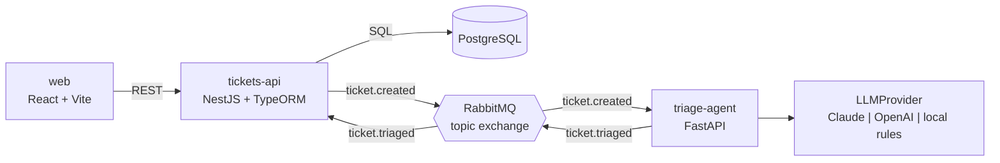

# Support Triage

Event-driven support desk. A customer ticket is stored by a NestJS API, published to RabbitMQ, and classified by a Python agent (category, priority, and a suggested first reply). The agent uses **Claude or OpenAI when an API key is present, and a local rule-based classifier when not**, so the whole system runs, and its CI passes, without any paid API.


## Architecture



1. The panel posts a ticket. `tickets-api` validates it, saves it as `pending_triage`, and publishes `ticket.created` (without the customer's email).
2. `triage-agent` consumes the event and asks the active provider for a `TriageDecision`. If the provider fails, it falls back to local rules.
3. The agent publishes `ticket.triaged`; `tickets-api` validates it and updates the ticket.
4. The panel polls quickly while something is pending and shows each ticket landing with its priority.

Design decisions, with the trade-offs and alternatives considered, are in [`docs/adr`](docs/adr):

- [0001 – Triage runs asynchronously through a queue](docs/adr/0001-async-triage-through-a-queue.md)
- [0002 – Pluggable LLM provider with a local fallback](docs/adr/0002-pluggable-llm-provider.md)
- [0003 – Publish after commit (and when to add an outbox)](docs/adr/0003-publish-after-commit.md)

## Run it

Requirements: Docker with Compose v2.

```bash
cp .env.example .env
docker compose up --build
```

| What | Where |
|---|---|
| Panel | http://localhost:5173 |
| Tickets API | http://localhost:3000/tickets |
| Agent API docs | http://localhost:8000/docs |
| RabbitMQ console | http://localhost:15672 (guest / guest) |

To use a real LLM, set `ANTHROPIC_API_KEY` (or `OPENAI_API_KEY`) in `.env` and restart `triage-agent`. `GET :8000/health` shows which provider is active.

End-to-end check against the running stack:

```bash
./scripts/smoke-test.sh
```

## Services

| Service | Stack | Responsibility |
|---|---|---|
| [`tickets-api`](services/tickets-api) | Node 24, NestJS 12 (ESM), TypeORM, PostgreSQL, amqplib | Owns tickets. Validates input, runs migrations, publishes and consumes events. |
| [`triage-agent`](services/triage-agent) | Python 3.12, FastAPI, Pydantic, aio-pika, Anthropic and OpenAI SDKs | Classifies tickets. Layered as routers → controllers → services (contracts) → implements. |
| [`web`](services/web) | React 19, Vite, TypeScript | Create tickets and watch the queue. |

## Tests

| Where | What | Command |
|---|---|---|
| `tickets-api` | HTTP validation, event publishing, broker-down behavior, triage consumer (in-memory fakes, no DB or broker) | `npm test` |
| `triage-agent` | Local classifier cases, provider selection, fallback on provider failure, event contract, endpoint validation | `uv run pytest` |
| `web` | Queue ordering and relative time formatting | `npm test` |
| Whole stack | Create a ticket and wait for it to be triaged | `./scripts/smoke-test.sh` |

GitHub Actions runs every suite on each push, then boots the full stack with Docker Compose and runs the end-to-end check.

## Security notes

- Request bodies and queue messages are validated; unknown fields are rejected.
- LLM output is parsed against a strict schema before it is trusted; the prompt marks ticket text as data.
- The customer's email never leaves `tickets-api`.
- CORS is limited to the panel's origin. Secrets come only from the environment; `.env` is git-ignored.
- Containers run as non-root users.

## How this repo is built

Development is AI-assisted under explicit engineering rules: see [CLAUDE.md](CLAUDE.md). The agent proposes changes; a human reviews and approves each one.

## Roadmap

- Transactional outbox for `ticket.created` (see ADR 0003)
- Authentication for the panel and API
- Evaluation set to compare providers' triage quality
